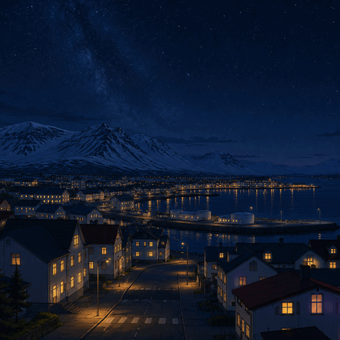

# 🇮🇸 Islande Dynamic Wallpaper

> Fond d'écran dynamique pour GNOME — paysage islandais animé style anime, 8 variations selon l'heure.



## Aperçu des transitions

| Heure | Ambiance |
|-------|----------|
| 00h00 – 05h00 | 🌑 Nuit profonde |
| 05h00 – 07h00 | 🌌 Nuit bleue |
| 07h00 – 09h00 | 🌅 Lever de soleil |
| 09h00 – 12h00 | 🧊 Matin froid |
| 12h00 – 15h00 | ☀️ Midi |
| 15h00 – 18h00 | 🌤️ Après-midi |
| 18h00 – 20h00 | 🌇 Coucher de soleil |
| 20h00 – 00h00 | 🌆 Crépuscule / aurore |

Les transitions entre phases sont progressives (overlay GNOME natif).

## Installation

### Prérequis

- GNOME (testé sur GNOME 45+)
- `gsettings` disponible (inclus par défaut)

### Installation rapide

```bash
git clone https://github.com/Mozeur/islande-wallpaper
cd islande-wallpaper
chmod +x setup.sh
./setup.sh
```

Le script :
1. Copie les 8 images dans `~/.local/share/backgrounds/Islande/`
2. Génère le XML dynamique adapté à ton système
3. Enregistre le wallpaper dans GNOME
4. L'applique immédiatement

### Désinstallation

```bash
./setup.sh --uninstall
```

## Structure du projet

```
islande-wallpaper/
├── setup.sh          # Script d'installation
├── README.md
└── wallpapers/
    ├── 1.png         # Nuit profonde
    ├── 2.png         # Nuit bleue
    ├── 3.png         # Lever de soleil
    ├── 4.png         # Matin froid
    ├── 5.png         # Midi
    ├── 6.png         # Après-midi
    ├── 7.png         # Coucher de soleil
    └── 8.png         # Crépuscule
```

## Comment ça marche

GNOME supporte nativement les fonds d'écran dynamiques via un fichier XML.
Pas de démon, pas de cron, pas de dépendance externe — c'est géré directement
par `gnome-session`.

Le fichier `islande-dynamic.xml` définit des blocs `<static>` (durée fixe)
et `<transition type="overlay">` (fondu entre deux images).

## Crédits

Images générées par IA (inspiration : paysages islandais, style anime/illustration).

